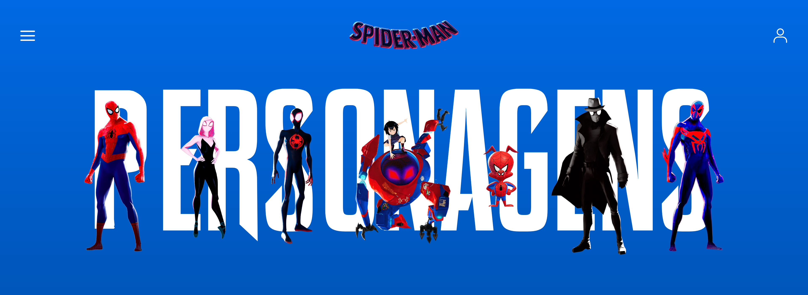

<<<<<<< HEAD
[](https://youtu.be/AedzxGZ4RV8)

### Veja o vídeo demonstração do projeto clicando na imagem ☝.

# Projeto Carrossel Spider-Verse

O projeto consiste em uma aplicação interativa inspirada no universo do Homem-Aranha, usando as principais stacks front-end: React, Next.js 13, a biblioteca Framer Motion, Sass e TypeScript para criar um projeto visual incrível e de alta performance.

=======


# Projeto Carrossel Spider-Verse

O projeto consiste em uma aplicação interativa inspirada no universo do Homem-Aranha, usando as principais stacks front-end: React, Next.js 13, a biblioteca Framer Motion, Sass e TypeScript para criar um projeto visual incrível e de alta performance.

[Watch the video](https://youtu.be/AedzxGZ4RV8)
>>>>>>> 25b362891f9ef9f521b19b9a071657accf7dd07d

## 💻 Tecnologias utilizadas no projeto

- [React.js](https://reactjs.org) (v18)
- [Next.js](https://nextjs.org) (v13)
- [TypeScript](https://www.typescriptlang.org) (v5)
- [ESLint](https://eslint.org)
- [Framer Motion](https://www.framer.com/api/motion)
- [SASS](https://sass-lang.com)

## 📚 Materiais

- [Material de apoio com tutorial completo](https://www.notion.so/Live-Criando-um-carrossel-parallax-do-Aranhaverso-com-React-Next-js-13-e-Framer-Motion-b0e527193c66459ca485645d3091913f?pvs=4)
- [Assets](https://drive.google.com/drive/folders/1RLpTFHz3T8qbjTLwtk68ajnDT7rVD97y?usp=sharing) (arquivos de imagens e efeitos sonoros)


## 🎨 Protótipo do projeto

[Clique aqui](https://www.figma.com/file/8qVMR9NabaVusyKEuJ43jW/Landpage---SpiderVerse?type=design&t=QfwqQCvhVkLqDDf6-0) para ir ao protótipo do projeto no Figma.

## 🗄️ Estrutura de pastas

O projeto está estruturado da seguinte forma:

- 📁 `public`
  - 📁 `icons`
  - 📁 `songs`
  - 📁 `spiders`
- 📁 `src`
  - 📁 `app`
    - 📁 `api`
      - 📁 `heroes`
    - 📁 `hero`
      - 📁 `[id]`
  - 📁 `components`
    - 📁 `Carousel`
    - 📁 `HeroDetails`
    - 📁 `HeroesList`
    - 📁 `HeroPicture`
  - 📁 `fonts`
  - 📁 `interfaces`

## 📄 Ponto de partida: template para começar do zero

- Dentro do repositório do Github do projeto você terá disponível uma branch denominada `template`, que contém a estrutura inicial para que você possa começar o projeto, contendo todos os assets, bibliotecas, estrutura de pastas e configurações de ESLint;
- Basta realizar um fork para sua conta e iniciar o desenvolvimento à partir dela. Se preferir, também pode começar o projeto do total zero, instalando as dependências descritas na sessão “Tecnologias utilizadas no projeto”.

## 🛠️ Instruções de execução

Siga as instruções abaixo para rodar o projeto em seu ambiente local:

1. Certifique-se de ter o Node.js instalado em seu computador. Você pode baixar a versão mais recente do Node.js em https://nodejs.org.

2. Clone este repositório em seu computador ou faça o download do código fonte.

3. Abra o terminal e navegue até o diretório raiz do projeto.

4. Instale as dependências do projeto executando o seguinte comando:

```bash
  yarn install
```

5. Após a conclusão da instalação das dependências, inicie o servidor de desenvolvimento local com o comando:

```bash
  yarn dev
```

6. O servidor local será iniciado e você poderá acessar o projeto no seu navegador através do seguinte endereço:

```bash
  http://localhost:3000
```

Caso a porta 3000 estiver em uso, automaticamente o Next.js irá subir na próxima porta livre da máquina.

Se deseja alterar a porta padrão na qual a aplicação tentará subir, você pode modificar a porta no arquivo `next.config.js`.

Agora você está pronto para explorar o projeto em seu ambiente local!

## 👩‍💻 DEV

<p>
    
    <p>&nbsp&nbsp&nbsp Eduardo G.<br>
    &nbsp&nbsp&nbsp<a href="http://instagram.com/programi_">&nbsp;<a href="https://github.com/Eduardo377">GitHub</a>&nbsp;|&nbsp;<a href="https://www.linkedin.com/in/eduardogomes377/">LinkedIn</a>&nbsp;</p>
</p>
<br/><br/>
<p>

---